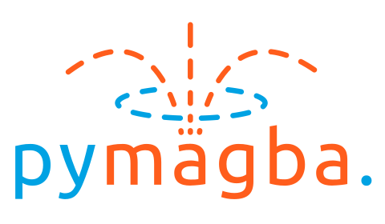

# PyMagba

<h1 align="center">
  <a href="https://github.com/p-sira/pymagba/">
    
  </a>
</h1>

<p align="center">
  <a href="https://opensource.org/license/BSD-3-clause" style="text-decoration: none">
    
  </a>
  <a href="https://pypi.org/project/pymagba" style="text-decoration: none">
    
  </a>
  <a href="https://pypi.org/project/pymagba" style="text-decoration: none">
    
  </a>
  <a href="https://p-sira.github.io/pymagba" style="text-decoration: none">
    
  </a>
</p>

---

**PyMagba** is a package for analytical magnetic computation, powered by Rust. All functions support numpy and parallelization.

## Quick Start

```python
from pymagba.magnets import *
from pymagba.sensors import *

magnet = CylinderMagnet(
   position=[0.0, 0.0, 0.01],
   diameter=0.01,
   height=0.005,
   polarization=[0.0, 0.0, 1.0],
)
sensor = LinearHallSensor(
   position=[0.0, 0.0, 0.025],
   sensitive_axis=[0.0, 0.0, 1.0],
   sensitivity=0.05,
   supply_voltage=5.0,
)
b_field = magnet.compute_B([0.0, 0.0, 0.025])  # [[0, 0, 0.01652363]]
voltage = sensor.read_voltage_cylinder(magnet)  # 2.5008261
```

## Installation

To install PyMagba, use your preferred package manager:

```shell
pip install pymagba
```

```shell
uv add pymagba
```

To install from source see the[Reproducibility](#reproducibility) section.


## Reproducibility

Clone into the repository:

```shell
git clone https://github.com/p-sira/pymagba.git
cd pymagba
```

To reproduce the build:

```shell
uv sync --group dev
cargo run --bin stub_gen --no-default-features
maturin build --release
```

Installing the build:

```shell
pip install target/wheels/pymagba-*.whl
```

Generating the docs:

```shell
uv sync --group dev
mkdir docs
cd docs
make html
```

To verify the installation and the generated stubs:

```shell
uv run pytest python/tests
uv run mypy python/pymagba
```
