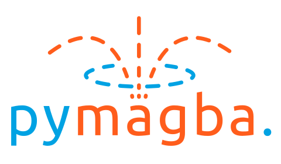

# PyMagba

<h1 align="center">
  <a href="https://github.com/p-sira/pymagba/">
    
  </a>
</h1>

<p align="center">
  <a href="https://opensource.org/license/BSD-3-clause" style="text-decoration: none">
    
  </a>
  <a href="https://pypi.org/project/pymagba" style="text-decoration: none">
    
  </a>
  <a href="https://pypi.org/project/pymagba" style="text-decoration: none">
    
  </a>
  <a href="https://p-sira.github.io/pymagba" style="text-decoration: none">
    
  </a>
  <a href="https://app.codspeed.io/p-sira/pymagba?utm_source=badge" style="text-decoration: none">
    
  </a>
</p>

---

**PyMagba** is a high-performance analytical magnetic computation for Python, powered by Rust [Magba](https://github.com/p-sira/magba). Designed for **large-scale magnetic computations and real-time processing** with seamless integration with NumPy/SciPy.

## Features

- ⚡ **Adaptive Rust-Native Performance:** Automatically routes to serial or multithreaded kernels based on machine-calibrated thresholds, completely bypassing the Python GIL. Smart workload estimators balance parallelization based on geometry complexity.
- 🧲 **Comprehensive Analytical Kernels:** Compute fields for cuboid, cylinder, sphere, triangle, tetrahedron, mesh, and dipole magnets. Includes current sources like circular, path, triangle, and meshed-sheet currents.
- 🐍 **NumPy/SciPy-Native & Flexible APIs:** Choose between object-oriented or functional paradigms. Fully supports single or batched observation points, returning standard `ndarray` results for seamless SciPy/NumPy integration.
- 🏗️ **Composable 3D Scenes:** Build complex magnetic environments using translations, quaternion/SciPy rotations, batched observer collections, and nested hierarchical source groups.
- 📐 **Advanced Mesh Geometry & Sensor Modeling:** Native support for STL-backed mesh sources and hardware modeling, including linear Hall sensors, threshold switches, and stateful Hall latches.

## Quick Start

```python
from pymagba.magnets import *
from pymagba.sensors import *

magnet = CylinderMagnet(
    position=[0.0, 0.0, 0.01],
    diameter=0.01,
    height=0.005,
    polarization=[0.0, 0.0, 1.0],
)
sensor = LinearHallSensor(
    position=[0.0, 0.0, 0.025],
    sensitive_axis=[0.0, 0.0, 1.0],
    sensitivity=0.05,
    supply_voltage=5.0,
)
b_field = magnet.compute_B([0.0, 0.0, 0.025])  # [[0, 0, 0.01652363]]
voltage = sensor.read_voltage(magnet)  # 2.5008261
```

## Installation

To install PyMagba, use your preferred package manager:

```shell
pip install pymagba
```

```shell
uv add pymagba
```

For building from source and advanced installation, please see [DEVELOPMENT.md](DEVELOPMENT.md).

## Testing

Users should refer to [Magba](https://github.com/p-sira/magba/blob/main/tests/README.md) for comprehensive accuracy report. For performance comparison between PyMagba and MagpyLib, please see [PERFORMANCE.md](PERFORMANCE.md).
